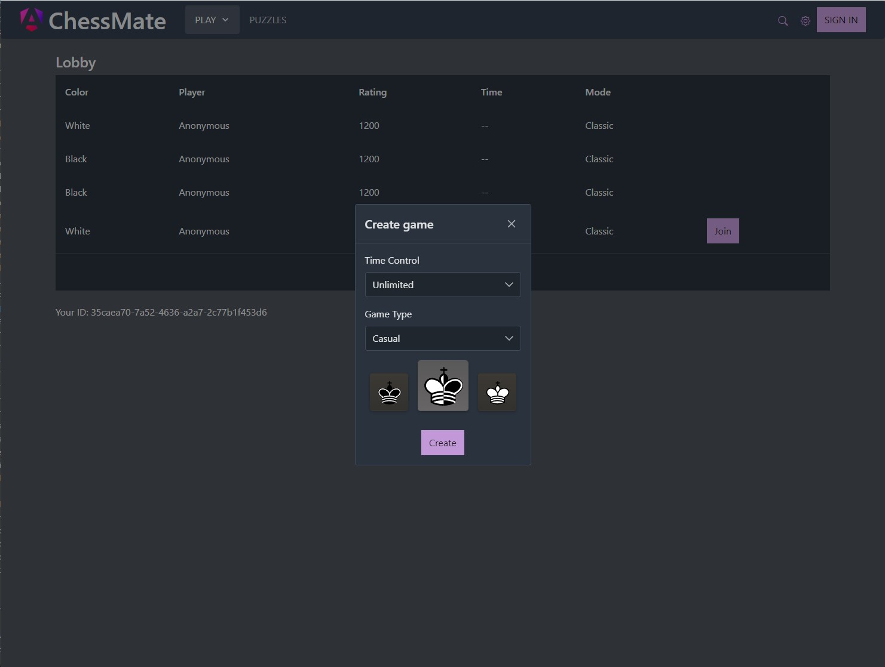
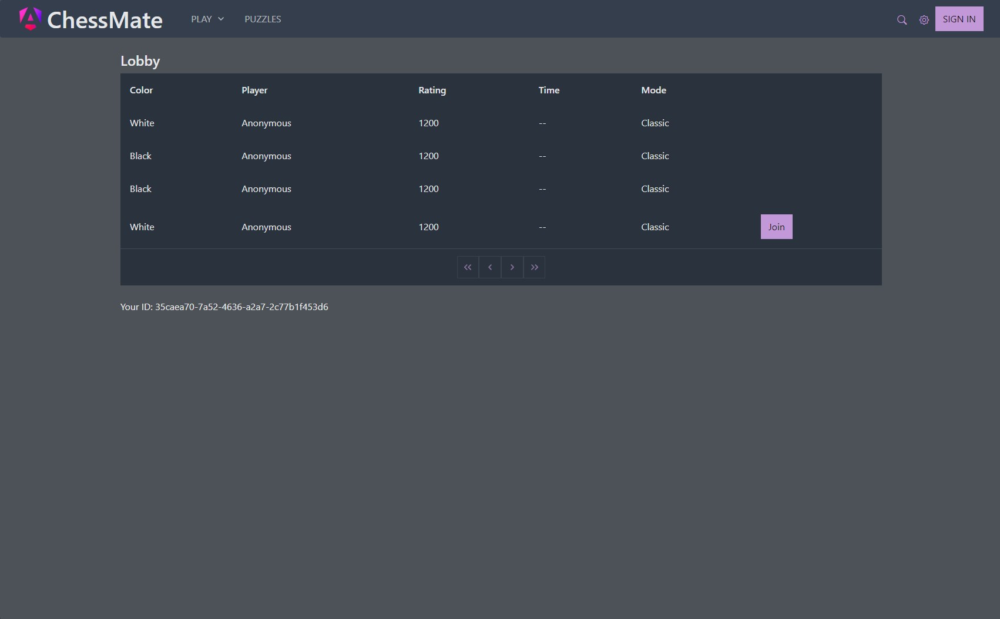
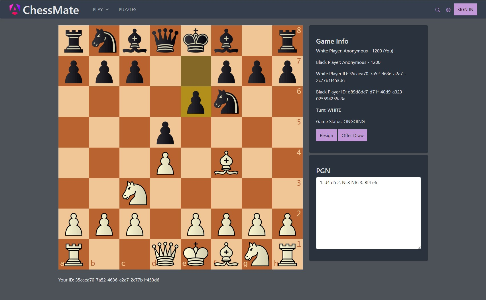

# ChessMate: Online Chess Platform
ChessMate is an online chess platform where players can engage in player-versus-player (PvP) matches or compete against AI. The platform supports both rated games and friendly matches, catering to a wide audience ranging from complete beginners to seasoned chess veterans. ChessMate's goal is to make chess more accessible and enjoyable for everyone by eliminating the need for physical boards or in-person opponents. This web-based application is developed with Spring Boot for the backend and Angular for the frontend.

## Architectural Overview
### Technical Stack
- **Spring Boot** - Backend framework for building REST API applications
- **Spring Data JPA** -  Provides repository support for JPA data access
- **Spring Websocket** - Synchronizes game state between players in real-time
- **PostgreSQL** - An open-source relational database to store game data
- **Flyway** - Manages database migrations
- **JUnit** - Facilitates unit testing in Java
- **Auth0** - SSO authentication
- **Angular 17** - Frontend framework to build SPA applications
- **PrimeNG** - Rich set of UI components for the Angular
- **Bootstrap 5** - CSS library for quickly prototyping layouts

### Design Patterns
- Mode-View-Controller (MVC)
- Repository
- Inversion of Control / Dependency injection

### Implemented Features
- Chess board with drag-and-drop functionality
- Real-time game synchronization using Websockets
- Chess engine integration for validating moves (converted the [Chess.js](https://github.com/jhlywa/chess.js) library to Java)
- Anonymous and authenticated user support

### Future Enhancements
- Resign and draw game options
- Authenticated game rooms for private matches
- User registration and profile management
- Leaderboard and game history tracking
- Stockfish engine integration for AI opponents
- Chat functionality between players
- UI improvements and responsive design

## Getting Started
To set up ChessMate locally, follow these steps:

1. Install SDKs
    - [Download](https://www.oracle.com/java/technologies/downloads) and install the latest JDK.
    - [Download](https://nodejs.org/en/download) and install the Node.js runtime.
    - [Download](https://www.postgresql.org/download) and install PostgreSQL database.

2. Install Angular app NPM packages: navigate to the frontend directory and install dependencies:
    ```shell
    cd ./frontend
    npm install
    ```

3. Modify the database connection strings in Spring Boot's [application.properties](./backend/src/main/resources/application.properties) file. Update the following sections:
    - `spring.datasource.url` - Specify the database server host address with port number and instance name.
    - `spring.datasource.username` - Specify the database username
    - `spring.datasource.password` - Specify the database user password
    - `spring.flyway.url` - Same values from the `spring.datasource` values for the Flyway migration.
    - `spring.flyway.user`
    - `spring.flyway.password`

4. Run applications:
    - To start the backend application:
    ```shell
    cd ./backend
    ./gradlew bootRun
    ```

    - To launch the frontend application:
    ```shell
    cd ./frontend
    npm run start
    ```

5. Use the following local URLs to access the apps:
    - Backend API: http://localhost:8000
    - Frontend UI: http://localhost:8001

## Screenshots


